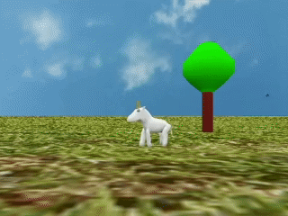

small3d
=======

This is a free, open-source, minimalistic 3D game engine, developed in C++ and using OpenGL with shaders. 

Features
--------

- Runs on Windows, Mac, Linux (tested on Debian, Fedora and Ubuntu).
- It works with GLFW.
- Uses OpenGL 3.3 and defaults to 2.1 if the former is not available.
- Uses C++11.
- You can tweak the engine's shaders, as long as you keep the same incoming variables and uniforms.
- Plays sounds from .ogg files.
- Doesn't hide GLFW or OpenGL from you. You can set up your main game loop, inputs, etc, however you want, use its functionality, but also code around it making your own OpenGL calls for example.
- It can read and render models from Wavefront files, including animations. Personally, I use Blender to create the models.
- Texture mapping.
- It can render any image in any position (for example to be used as the ground, or the sky).
- Gouraud shading. You can set the light direction and intensity.
- Simple rotations with matrices.
- Simple collision detection with bounding boxes.
- It renders text.
- Very permissive license (3-clause BSD). The libraries it uses have been chosen to have a permissive license also.

Building
--------

Before starting, note that cmake has to be installed on your system and accessible on the command line. On Windows, 7zip also has to be in the path. Note that I am using MinGW there and I don't support Visual Studio.

The source code for all of small3d's dependencies can be found in the *deps* directory. These are the required libraries:

- [GLFW](http://www.glfw.org/) *Not needed on Linux, where it is deployed as a package by the prepare.sh script.*
- [GLEW](https://sourceforge.net/projects/glew/files/glew/2.1.0/)
- [GLM](https://github.com/g-truc/glm)
- [PNG](http://libpng.sourceforge.net/)
- [ZLIB](http://zlib.net/)
- [Google Test](https://github.com/google/googletest)
- [OGG](https://github.com/xiph/ogg/releases)
- [Vorbis](https://github.com/xiph/vorbis/releases)
- [Portaudio](http://www.portaudio.com/download.html) *Not needed on Linux, where it is deployed as a package by the prepare.sh script.*
- [FreeType](http://download.savannah.gnu.org/releases/freetype/)
- [bzip2](http://bzip.org/) *Not needed on Windows.*

Run the *prepare.bat* (Windows) or *prepare.sh* script from within the *deps* directory, in order to build the dependencies.

Then, create a directory inside *small3d*, called *build*. Then, build like this:

    cd build
    cmake ..
    cmake --build .
	
On Windows, you need to execute `cmake .. -G"MinGW Makefiles"`, otherwise cmake will probably try to configure the project with Visual Studio.
	
The unit tests can be run by running the *unittests* binary from *build/bin*. For building your own project, you need the header files from the *build/include* directory, the libraries from the *build/lib* directory and the shaders from *small3d/resources/shaders*. If you are using cmake, the modules in *small3d/cmake* can be useful. Also, if you are on a Mac, remember to set the linker flags of your own projects the way I do for the unit tests (see src/CMakeLists.txt).

Note on 3D models and textures
------------------------------

The Wavefront .obj files used for the engine's models have to have a certain structure. Exporting them from Blender for example, we need to make sure we set the options **Write Normals**, **Triangulate Faces**, and **Keep Vertex Order**. When exporting animations, also set **Apply modifiers**. Only one object should be exported to each Wavefront file (the engine cannot read more than one).

If a texture has been created, the option **Include UVs** must also be set. The texture should be saved as a PNG file.

Collision Detection
-------------------

The engine supports collision detection via manually created bounding boxes. In order to create these in Blender for example, just place them in the preferred position over the model. Ideally, they should be aligned with the axes but that is not mandatory. It will just increase the detection accuracy.

Export the bounding boxes to a Wavefront file separately from the model. You can do this if you "save as" a new file after placing the boxes and deleting the original model. During export, only set the options **Apply Modifiers**, **Include Edges**, **Objects as OBJ Objects** and **Keep Vertex Order**. On the contrary to what is the case when exporting the model itself, more than one bounding box objects can be exported to the same Wavefront file.

 
