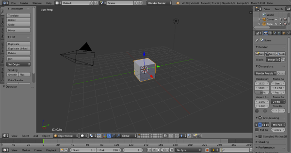
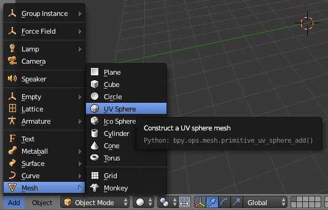
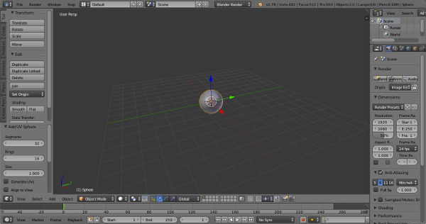
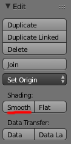
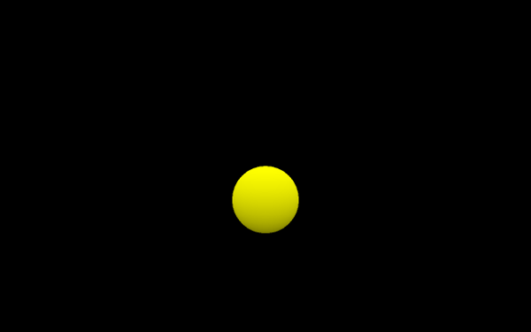

# small3d

[[Source Code]](https://github.com/dimi309/small3d) [[API Documentation]](https://dimi309.github.io/small3d)

## Introduction

This is a free, open source, minimalistic 3D framework for the programmer who 
would like to make games using a basic set of libraries (glfw, 
glm, png, zlib, ogg, vorbis, portaudio, freetype, bzip) and relying on
C++ to do the rest. It helps you by providing you with cross-platform rendering
functionality based on Vulkan. It can also be compiled with OpenGL. 

small3d can render Wavefront models, animate them as frames, map textures on 
them, provide some basic lighting (Gouraud shading) and also render images and
text.

A very easy to use Sound object is also provided that can play OGG files on all
supported platforms via a common interface. Basic collision detection has
also been implemented.

small3d works on Windows, MacOS, Linux, iOS and Android and supports Visual 
Studio, Xcode, gcc (even MinGW) and clang for compilation.

All small3d dependencies, apart from the Vulkan SDK, are distributed together 
with its source code. They can be built by executing a single script (see 
below).

## Building

Before starting, note that the Vulkan SDK and cmake have to be installed on 
your system and accessible on the command line. On Windows, 7zip also has to be 
in the path and you also need to install the MinGW compiler or Visual Studio, 
again with their tools available on the command line.

Run the *prepare.bat* (Windows MinGW), *prepare-vs.bat* (Windows Visual Studio)
or *prepare.sh* script from within the *deps* directory, in order to build the
dependencies.

Then, create a directory inside *small3d*, called *build*. Then, build like
this:

    cd build
    cmake ..
    cmake --build .
	
On Windows, you need to execute `cmake .. -G"MinGW Makefiles"`, 
or with the preferred Visual Studio configuration
(e.g. `cmake .. -G"Visual Studio 16 2019" -A x64`).
Make sure that *prepare-vs.bat* is run with the same configuration (see the
parameters at the top, inside the file). Also, make sure to run build under the
configuration also defined in *prepare-vs.bat* parameters, e.g.
`cmake --build . --config Debug`. 

If you would rather build small3d with OpenGL rather than Vulkan, also add
the definition `-DSMALL3D_OPENGL=ON` when running `cmake ..`.
	
The unit tests can be run via the *unittests* binary from *build/bin*. 

For building your own project, you need the header files from 
the *build/include* directory, the libraries from the *build/lib* directory and
the shaders from *build/shaders*. If you are using cmake, the
modules in *small3d/cmake* can be useful. Check the CMakeLists.txt and
src/CMakeLists.txt files for other configuration details (link flags, etc) that 
may also be required or useful.

## Xcode workarounds

On MacOS, the small3d unit tests and sample game work like on any other platform
when configured with cmake by default:

	cmake ..

However you might want to create an Xcode project, in order to Debug your
program in Xcode for example. In that case, some additional steps are needed, in
order to ensure that the programs run without error. First of all, small3d
together with its unit tests can be configured and built for Xcode as follows:

	cmake .. -G"Xcode"
	cmake --build .

The created project, `build/small3d.xcodeproj` can then be opened in Xcode.

There are two things that need to be taken care of before proceeding to run
and debug the unit tests though. First of all, from the Project Navigator,
click on `small3d`, and then on the `unittests` target. Select Build Settings
and scroll down to User-Defined. There, the `CONFIGURATION_BUILD_DIR` variable
needs to be set to the `bin` directory in all cases,
for example `/Users/me/Source/small3d/build/bin/`, rather than the
differentiated directories it is set to by default, e.g. `bin/Debug`, 
`bin/Release`, etc.

The other problem is that, if you have set some Vulkan-related environment 
variables in bash / zsh, Xcode is not aware of them. Select the `unittests` 
target and then select Edit Scheme. Then select Run Debug, Arguments and add 
the necessary Environment Variables. They cannot be exactly the same as in 
`.zprofile` or `.bash_profile`. For example `VULKAN_SDK` does not need to be
defined in this case and its value cannot be reused as `$VULKAN_SDK`anyway.
They should look somewhat like these (note that, in my case, I do not install
the Vulkan SDK. I just unzip it in my `Software` directory. So your specific
path locations may vary):

	PATH=$PATH:/Users/user/Software/vulkansdk-macos-1.2.154.0/macOS/bin
	DYLD_LIBRARY_PATH=$DYLD_LIBRARY_PATH:/Users/user/Software/vulkansdk-macos-1.2.154.0/macOS/lib
	VK_LAYER_PATH=/Users/user/Software/vulkansdk-macos-1.2.154.0/macOS/share/vulkan/explicit_layer.d
	VK_ICD_FILENAMES=/Users/user/Software/vulkansdk-macos-1.2.154.0/MoltenVK/dylib/macOS/MoltenVK_icd.json

## small3d on mobile

The scripts for preparing the dependencies of small3d for mobile are `prepare-android`
and `prepare-ios` for Android and iOS respectively, found in the `deps` directory. 
After executing one of those, you can build small3d for these platforms by executing
either `build-android` or `build-ios` from the main directory. The sample game, 
[Avoid the Bug](https://github.com/dimi309/avoidthebug) has been ported to
both [Android](https://github.com/dimi309/avoidthebug-android) and 
[iOS](https://github.com/dimi309/avoidthebug-ios). I use these projects as a basis
for mobile development. Note that, while with the desktop edition of small3d
I use GLFW for windowing functionalities and I/O, on mobile I access the native
infrastructure directly.

# Example

Let's move an object around the screen.

## Get a 3D model

We need a Wavefront file. Suppose that it is a model of a ball, called 
ball.obj. Here's how to make one with Blender (skip the following part if you
already have a model ready and go to the Setup section).

When you start Blender, you see a cube:

Press "a" to select it. If the cube is selected already, pressing "a" will
de-select it. Press it again in that case. Then "x" to delete the cube. You will
be asked to confirm the deletion:

Just press enter to do so. Then, from the menu at the bottom left of the 3D
view, select Add > Mesh > UV Sphere:

This will create, as the name implies, a sphere:

With the sphere selected (use the "a" key if it is not), click on the "Smooth"
button, under "Shading" on the "Edit" menu on the left of the screen:

This is not important but it will make the sphere look better :) 

We now need to create the Wavefront file. From the menu at the top, 
select File > Export > Wavefront (.obj). We need to set some options on
the "Export OBJ" menu on the left. Only select "Write Normals",
"Triangulate Faces" and "Keep Vertex Order":

*Note: Later, for exporting animations to a series of Wavefront files in a way 
that will allow small3d to load them, also select "Animation" and 
"Apply Modifiers".*

Save the exported file as "ball.obj".

## Setup

Let's proceed to make our first program. Create a directory, called *ball*.
Then create another directory within it, called *resources* and place *ball.obj*
in it. Also add the following code to a CMakeFiles.txt within the *ball*
directory:

	cmake_minimum_required(VERSION 3.0.2)

	project(ball)

	file(COPY "resources" DESTINATION "${PROJECT_BINARY_DIR}/bin")
	file(COPY "deps/shaders" DESTINATION "${PROJECT_BINARY_DIR}/bin/resources")

	set(CMAKE_RUNTIME_OUTPUT_DIRECTORY "${PROJECT_BINARY_DIR}/bin")

	set(CMAKE_MODULE_PATH ${PROJECT_SOURCE_DIR}/cmake)

	if(MSVC)
		set(CMAKE_RUNTIME_OUTPUT_DIRECTORY_DEBUG "${PROJECT_BINARY_DIR}/bin")
		set(CMAKE_RUNTIME_OUTPUT_DIRECTORY_RELEASE "${PROJECT_BINARY_DIR}/bin")
	endif(MSVC)

	set(DEPS_PATH "${CMAKE_SOURCE_DIR}/deps")
	set(CMAKE_PREFIX_PATH ${DEPS_PATH})

	if(MSVC)
		set(CMAKE_CXX_FLAGS_RELEASE "${CMAKE_CXX_FLAGS_RELEASE} /MT")
		set(CMAKE_CXX_FLAGS_DEBUG "${CMAKE_CXX_FLAGS_DEBUG} /MTd")
	elseif(WIN32)
		set(CMAKE_CXX_FLAGS "${CMAKE_CXX_FLAGS} -std=gnu++11")
		set(CMAKE_EXE_LINKER_FLAGS "-static-libgcc -static-libstdc++ -static")
	elseif(APPLE)
		set(CMAKE_CXX_FLAGS "${CMAKE_CXX_FLAGS} -std=c++11 -stdlib=libc++")
	elseif(UNIX)
		set(CMAKE_CXX_FLAGS "${CMAKE_CXX_FLAGS} -std=c++11")
	endif(MSVC)
	
	find_package(Vulkan REQUIRED) # Delete for OpenGL
	# Uncomment for OpenGL:
    # find_package(OpenGL REQUIRED)
	# find_package(GLEW REQUIRED)
	find_package(GLFW REQUIRED)
	find_package(PNG REQUIRED)
	find_package(GLM)
	find_package(OGG REQUIRED)
	find_package(VORBIS REQUIRED)
	find_package(Portaudio REQUIRED)
	find_package(Freetype REQUIRED)
	find_package(SMALL3D REQUIRED)

	if(UNIX)
		find_package(BZip2 REQUIRED)
	endif(UNIX)

	subdirs(src)

Create a directory called *src* within the *ball* directory and, inside it,
another *CMakeLists.txt* file:

	add_executable(ball main.cpp)

	target_include_directories(ball PUBLIC "${CMAKE_SOURCE_DIR}/include")

	target_include_directories(ball PUBLIC
		${SMALL3D_INCLUDE_DIR}
		${GLFW_INCLUDE_DIRS}
		${Vulkan_INCLUDE_DIR} # Replace with ${OPENGL_INCLUDE_DIR} for OpenGL
		${PNG_INCLUDE_DIRS}
		${GLM_INCLUDE_DIRS}
		${OGG_INCLUDE_DIRS}
		${VORBIS_INCLUDE_DIR}
		${PORTAUDIO_INCLUDE_DIRS}
		${FREETYPE_INCLUDE_DIRS}
	)

	target_link_libraries(ball PUBLIC
		${SMALL3D_LIBRARY}
		# Uncomment for OpenGL
		# ${GLEW_LIBRARIES}
		# ${OPENGL_LIBRARIES}
		${GLFW_LIBRARIES}
		${Vulkan_LIBRARIES} # Remove for OpenGL
		${PNG_LIBRARIES}
		${VORBIS_LIBRARIES}
		${OGG_LIBRARIES}
		${PORTAUDIO_LIBRARIES}
		${FREETYPE_LIBRARIES}
	)

	if(UNIX)
		target_include_directories(ball PUBLIC
			${BZIP2_INCLUDE_DIRS})
		target_link_libraries(ball PUBLIC
			${BZIP2_LIBRARIES})
	endif(UNIX)

	if(WIN32)
		target_link_libraries(ball PUBLIC winmm)
	endif(WIN32)

	if(APPLE)
		set_target_properties(ball PROPERTIES LINK_FLAGS "-framework \
		AudioUnit -framework AudioToolbox -framework CoreAudio -framework Cocoa \
		-framework IOKit -framework CoreVideo")
	endif(APPLE)

	if(MSVC)
		set_target_properties(ball PROPERTIES LINK_FLAGS_DEBUG
			"-NODEFAULTLIB:LIBCMTD")
		set_target_properties(ball PROPERTIES LINK_FLAGS_RELEASE
			"-NODEFAULTLIB:LIBCMT")
  
	    set_target_properties(ball PROPERTIES VS_DEBUGGER_WORKING_DIRECTORY
			"${small3d_BINARY_DIR}/bin")
	endif(MSVC)

## The code

Inside *ball/src*, create the *main.cpp* file:

	int main(int argc, char **argv) {
	
		return 0;
	}

Include small3d's Renderer and SceneObject classes:

	#include <small3d/Renderer.hpp>
	#include <small3d/SceneObject.hpp>

Now we need the GLFW header files:

	#include <GLFW/glfw3.h>

We also need to be using the small3d namespace, so this goes under our include
statements:

	using namespace small3d;
	
We also need to write the logic that will be detecting key presses:

	bool downkey, leftkey, rightkey, upkey, esckey;

	void keyCallback(GLFWwindow* window, int key, int scancode, int action,
		int mods)
	{
	if (key == GLFW_KEY_DOWN && action == GLFW_PRESS)
      downkey = true;
	if (key == GLFW_KEY_UP && action == GLFW_PRESS)
      upkey = true;
	if (key == GLFW_KEY_LEFT && action == GLFW_PRESS)
      leftkey = true;
	if (key == GLFW_KEY_RIGHT && action == GLFW_PRESS)
      rightkey = true;
	if (key == GLFW_KEY_ESCAPE && action == GLFW_PRESS)
      esckey = true;
	if (key == GLFW_KEY_DOWN && action == GLFW_RELEASE)
      downkey = false;
	if (key == GLFW_KEY_UP && action == GLFW_RELEASE)
      upkey = false;
	if (key == GLFW_KEY_LEFT && action == GLFW_RELEASE)
      leftkey = false;
	if (key == GLFW_KEY_RIGHT && action == GLFW_RELEASE)
      rightkey = false;
	if (key == GLFW_KEY_ESCAPE && action == GLFW_RELEASE)
      esckey = false;

	}

And finally, we go to the main program, and we create the renderer. The
renderer is a singleton, so it can only be retrieved via the getInstance
method, and assigned to a pointer:

	Renderer *renderer = &Renderer::getInstance("Ball demo");
    
We will later need to access the window of the application, in order to pick up
key events:

    GLFWwindow* window = renderer->getWindow();

We create the ball:

	SceneObject ball("ball", "resources/ball.obj");

small3d uses vectors a lot as parameters for convenience. When positioning the
ball, the components are in order, x (-left, +right), y(+up, -down), and
z(-away from the camera, +towards the camera):

	ball.offset = glm::vec3(0.0f, -1.0f, -8.0f);

So let's start our main loop now. small3d uses GLFW and you can use it too!
First we need to declare the callback function, which will be the keyCallback
method we wrote above.

	glfwSetKeyCallback(window, keyCallback);

Now in every iteration, we need to check whether we want to exit the program.
Let's say that we'll be doing that with the Esc key:

	while (!glfwWindowShouldClose(window) && !esckey) {

	glfwPollEvents();
		if (esckey)
			break;

If after that we are still in the loop (so, no Esc key pressed), we will want to
move the ball around with the keyboard. 

We will have the up arrow move the ball away from the camera. Down will do the
opposite. Guess what left and right will do :)

	if (upkey)
      ball.offset.z -= 0.1f;
    else if (downkey)
      ball.offset.z += 0.1f;
    else if (leftkey)
      ball.offset.x -= 0.1f;
    else if (rightkey)
      ball.offset.x += 0.1f;

Ok, the ball is positioned. Now we need to actually draw it. We clear the screen
first:

	renderer->clearScreen();

Then we render the ball. The second parameter is the colour. Let's say it's 
yellow (the vector below symbolises an rgb colour, together with the alpha
channel):
	
	renderer->render(ball, glm::vec4(1.0f, 1.0f, 0.0f, 1.0f));

We are using a double-buffered system (we draw on one buffer, while the user is
looking at the other one), so we also need to swap the buffers:

	renderer->swapBuffers();

And we close the loop :)

	}

That's it!

Let's try it out. Create a *ball/deps* directory and from the built small3d
framework (see Building section above) copy the *build/include*, *build/lib*
and *build/shaders* directories to this *deps* directory. Also, copy the 
*cmake* directory from the root of the small3d framework repository to the 
root *ball* directory. Then, back from the root *ball* directory execute:

	mkdir build
	cd build
	cmake ..
	cmake --build .
	cd bin
	./ball

On Windows, you need to execute `cmake .. -G"MinGW Makefiles"`,
or with the preferred Visual Studio configuration
(e.g. `cmake .. -G"Visual Studio 16 2019" -A x64`).

Note that you have to be inside the build/bin directory in order to execute the
program, otherwise it will not find the necessary resource files (shaders,
textures, etc).

There's our ball:

Try moving it around with the arrows. A good way to learn about the other 
features of small3d is to read the documentation (in docs) and also to explore 
the source code of the sample games.

## Collision Detection

The framework supports collision detection via manually created bounding boxes. 
In order to create these in Blender for example, just place them in the 
preferred position over the model. Ideally, they should be aligned with the axes,
(but note that small3d does more than just a simple axis-aligned bounding box
collision detection).

Export the bounding boxes to a Wavefront file separately from the model. You can
do this if you "save as" a new file after placing the boxes and deleting the
original model. During export, only set the options **Apply Modifiers**, 
**Include Edges** (but not in newer versions of Blender, where it is not 
available), **Objects as OBJ Objects** and **Keep Vertex Order**. On the 
contrary to what is the case when exporting the model itself, more than one 
bounding box objects can be exported to the same Wavefront file.

It is good to keep the default origin in Blender for the models as well as the
bounding boxes. User-set origins are ignored by Blender when exporting Wavefront 
files. That can cause misalignments between bounding boxes and models, even if 
the origins of both have been properly set to a new position.
