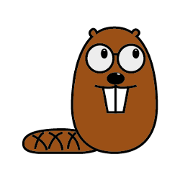

# small3d

[[Source Code]](https://github.com/dimi309/small3d) [[API Documentation]](https://dimi309.github.io/small3d)

Minimalistic, open source library for making 3D games in C++

This library provides a sufficient level of game development functionalities 
for C++ developers to be able to build cross-platform games based on a single 
code-base. Keeping the codebase easy to master and  minimising the amount 
of effort needed for maintenance is favoured over richness of features 
and the use of cutting edge methods and technologies.

# First Little Games

These are games that were developed while the library was being put together for the first time.

# More "Evolved" Titles
 
## Gloom

An open source 3D shooter

## Islet Hell

A flight simulator, once commercially released, now availale free of charge

# Non-game project

- [Serial Model Renderer](https://github.com/dimi309/serial-model-renderer), used to test the 3D model reading and rendering functionality of the library

# Features

- 3D models loaded from glTF (glb files), Wavefront (obj files) 
  or from a native format
- Other customised meshes and shapes
- Texture mapping
- Gouraud shading
- Basic materials support (colour, transparency)
- Shadow mapping
- Image rendering
- Font rendering
- Sound (ogg and native files)
- Collision detection
- Frame-based animation (Wavefront)
- Skeletal animation (glTF)

# Limitations

- Non-PNG images are not supported.
- There are no scenes, just SceneObjects rendered in an infinite space.
- The 3D model parsers are far from feature-complete but pretty robust 
  nonetheless. The goal is not to be able to read a complete node structure
  from a gltf file for example, but to extract individual models and their
  animations, in order to use them in a game.

# Supported platforms

- Windows
- Linux (Tested on Debian, Ubuntu, Fedora and Arch) 

# Discontinued support

At a time this library was also supporting MacOS, as well as  Android and Apple 
mobile devices, and it would even run on Vulkan. All that has now been 
discontinued as I have decided at some point to no longer own a Macbook and to 
no longer publish games for mobile, as it was getting a little complicated 
maintaining my presence on the respective app stores (costs, new legislation).

In case you would like to use it, this is the last version supporting MacOS:

https://github.com/dimi309/small3d/releases/tag/1.8017.last.macos

Here is an article on the reasons for abandoning Vulkan:

https://www.gamedev.net/blogs/entry/2275791-abandoning-vulkan/

And here is the last commit before the Vulkan renderer got removed:

https://github.com/dimi309/small3d/releases/tag/1.8015.last.vulkan

Finally, this is the last version supporting mobile devices:

https://github.com/dimi309/small3d/releases/tag/1.8016.last.mobile

# Tutorial

https://www.gamedev.net/tutorials/programming/engines-and-middleware/small3d-tutorial-r5655/

# Building and deploying

## Prerequisites

The following need to be installed, with the relevant environment variables
and tools accessible via the command line:

- Some compiler (e.g. gcc, Visual Studio, clang) with C++17 support recommended
  as a minimum.
- 7zip (only on Windows)
- CMake

## Deploying small3d

Run the build script which is suitable to your platform from the `scripts` 
directory (`build-vs.bat`, `build-mingw.bat` or `build.sh`).
	
Then, the unit tests are executed by running `unittests` binary from `build/bin`.

If any of this fails or you would simply like to restart the building
procedure, the best way to clean the repository is by using git:

	git clean -fdx

For building your own project, you need:

- The header files from the `build/include` directory
- The libraries from the `build/lib` directory 
- The shaders from `build/shaders` directory
- The `small3d/cmake` directory if you will be using cmake

You can also deploy using [conan](https://conan.io). The conan package is 
provided in a [separate repository](https://github.com/dimi309/small3d-conan).

A [boilerplate project](https://github.com/dimi309/small3d-boilerplate) is also 
available. It provides a basic setup of a game loop with user inputs so that you 
start coding your game right away.

# Referenced libraries

The following dependencies' *source code* repositories (not binaries) are 
distributed in this same repository (in the `deps` directory). They can be built
by executing a single script (see "Building", above) and they can also be used 
directly in your application / game code.

- glew
- glfw 
- png
- zlib
- ogg
- vorbis
- portaudio
- freetype
- cereal
