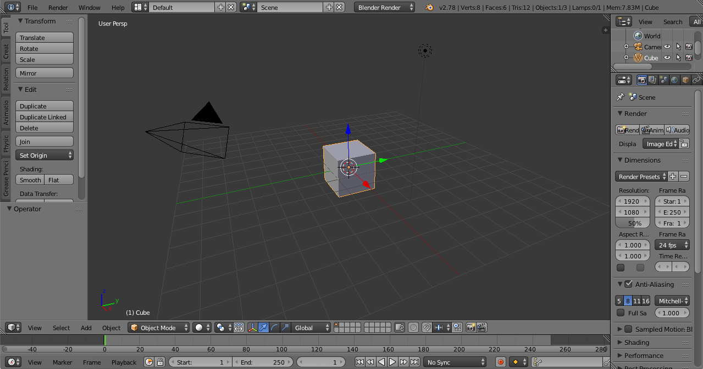
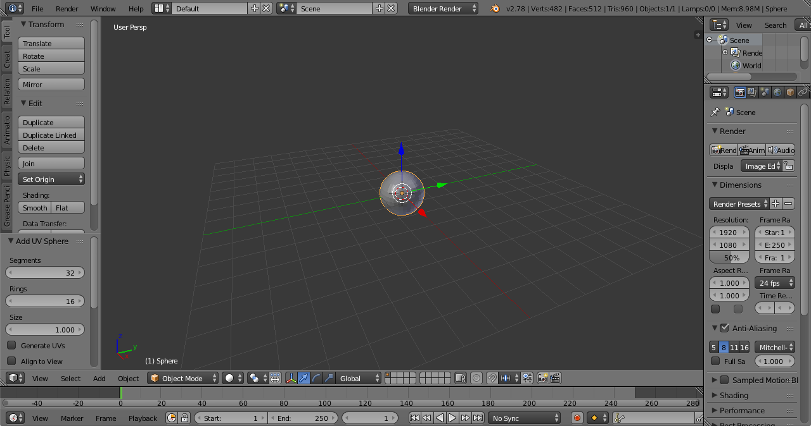
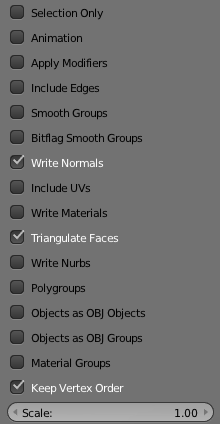

How to create a simple 3D model for small3d 
===========================================

This is an example of how to use  [Blender](https://www.blender.org) to create a Wavefront file that can be used by small3d.

There is no code listed here. For coding examples, have a look at two games that have been developed with small3d, [Avoid the Bug](https://github.com/dimi309/avoidthebug) and [Chase the Goat](https://github.com/dimi309/chasethegoat).

When you start Blender, you see a cube:

Press "a" to select it. If the cube is selected already, pressing "a" will de-select it. Press it again in that case. Then "x" to delete the cube. You will be asked to confirm the deletion:

Just press enter to do so. Then, from the menu at the bottom left of the 3D view, select Add > Mesh > UV Sphere:

This will create, as the name implies, a sphere:

With the sphere selected (use the "a" key if it is not), click on the "Smooth" button, under "Shading" on the "Edit" menu on the left of the screen:

This is not important but it will make the sphere look better :) 

We now need to create the Wavefront file. From the menu at the top, select File > Export > Wavefront (.obj). We need to set some options on the "Export OBJ" menu on the left. Only select "Write Normals", "Triangulate Faces" and "Keep Vertex Order":

Save the exported file as "ball.obj" in the "resources" directory, created earlier (there is a location and name selector at the top and an "Export OBJ" button to actually save the file).

